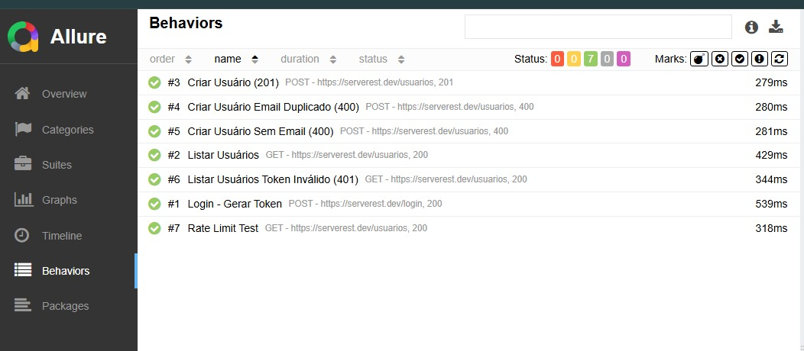
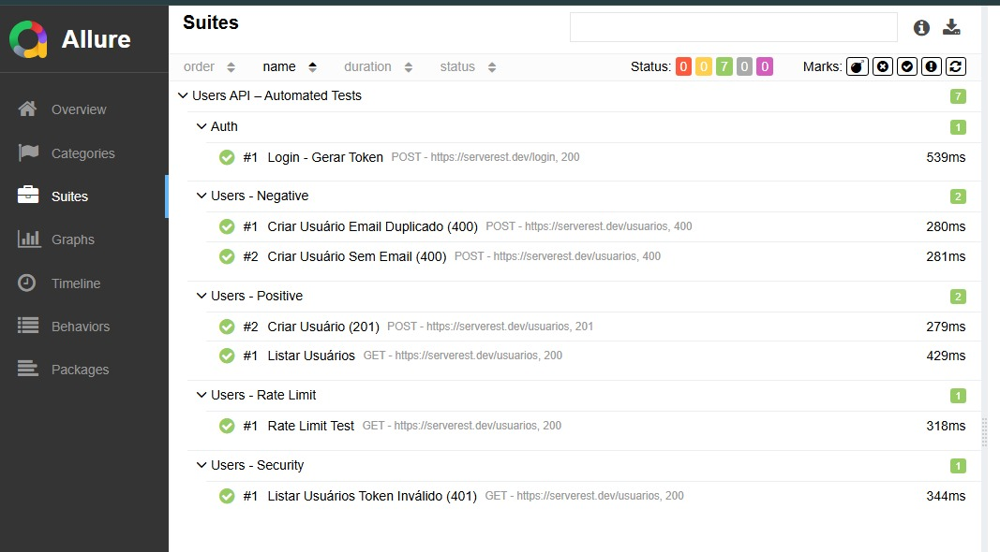
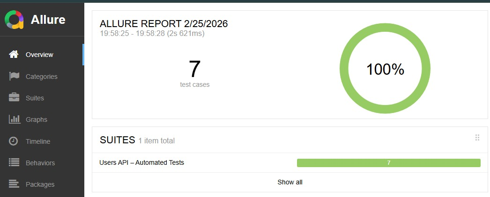

# 🚀 API Automation Challenge  
### Banco Carrefour – QA Automation

Este projeto demonstra a implementação de uma estratégia completa de automação de testes de API, aplicando boas práticas de organização, controle de massa de dados, execução em lote e geração de relatórios.

A solução foi construída com foco em:

- ✔ Estrutura clara e escalável de testes
- ✔ Separação de cenários positivos e negativos
- ✔ Validação de regras de negócio
- ✔ Controle dinâmico de dados para execução repetida
- ✔ Execução via linha de comando (Newman)
- ✔ Geração de relatórios com Allure
- ✔ Preparação para integração contínua (CI/CD)

---

## 🎯 Objetivo do Projeto

Validar o comportamento da API por meio de testes automatizados organizados por contexto funcional, cobrindo:

- Autenticação
- Operações de usuários
- Validações de erro
- Análise de segurança
- Testes de execução em lote (Rate Limit)

O projeto foi estruturado para permitir fácil manutenção, reexecução e integração em pipeline automatizado.

---

> **Importante:** `node_modules/` e `allure-results/` não devem ser enviados ao repositório.

---

## 🛠️ Tecnologias / Ferramentas

- **Postman** (criação dos requests e scripts)
- **Node.js (LTS)** (runtime para Newman)
- **Newman** (runner da collection no terminal/CI)
- **Allure Report** (relatórios)
- **Java (JDK 17+)** (requisito do Allure)
- **Git** (versionamento)
- (Opcional) **VS Code** (edição do projeto)

---

## ✅ Pré-requisitos

### 1) Node.js (LTS)
Instale o Node.js (versão LTS) e valide:

```bash
node -v
npm -v
````

### 2) Git

Instale o Git e valide:

```bash
git --version
```

### 3) Java (para Allure)

Instale **JDK 17+** (ex: Adoptium Temurin 17) e valide:

```bash
java -version
```

> Caso apareça erro de `JAVA_HOME`, instale o Java marcando:
>
> * ✅ Add to PATH
> * ✅ Set JAVA_HOME

---

## 📦 Instalação / Setup do Projeto

### 1) Clonar o repositório

```bash
git clone https://github.com/Natanaeldlb/api-automation-carrefour.git
cd api-automation-carrefour
```

### 2) Instalar dependências (opcional)

Se você quiser manter Newman instalado localmente via `package.json`:

```bash
npm install
```

> Se não tiver `node_modules`, sem problema: você pode usar o Newman global.

---

## 🔧 Configuração do Environment

O projeto usa variáveis do Postman via `environment.json`.

### Variáveis essenciais:

* `base_url` = `https://serverest.dev`
* `token` = gerado automaticamente pelo login (durante a execução)
* `email_dinamico` = gerado via script (para evitar duplicidade em execução em lote)

> Se você tiver erro do tipo `Invalid URI "http:///login"` no Newman, significa que o `base_url` está vazio no `environment.json`.

---

## ▶️ Execução Local (Newman)

### Opção A — Newman global (recomendado para rodar rápido)

Instale o Newman globalmente:

```bash
npm install -g newman
```

Execute:

```bash
newman run collection.json -e environment.json
```

---

## 📊 Relatórios com Allure

### 1) Instalar Allure Reporter do Newman

```bash
npm install -g newman-reporter-allure
```

### 2) Rodar com Allure

```bash
newman run collection.json -e environment.json -r allure
```

Isso gera a pasta:

```
allure-results/
```

---

## 📊 Evidências da Execução

Abaixo estão evidências da execução dos testes via Newman com geração de relatório em Allure.

### 🟢 Visão Geral da Execução

### Evidência - 01



### Evidência - 02



### Evidência - 03



---

### 3) Visualizar relatório (servidor local)

> O comando `allure` depende do Java instalado.

Se você já tem o Allure CLI no PATH, rode:

```bash
allure serve allure-results
```

> Se o seu ambiente não tiver o comando `allure`, instale o Allure CLI ou use uma distribuição do Allure disponível para Windows.
> (Caso você já esteja usando e funcionou no seu setup, basta repetir o comando acima.)

---
## 📊 Relatório Allure (GitLab Pages)

Acesse o relatório gerado automaticamente pela pipeline:

👉 https://api-automation-carrefour-a8194a.gitlab.io

---

## ⚙️ CI/CD (GitLab Pipeline)

A cada push na branch `main`, a pipeline:

1. Instala dependências
2. Executa os testes via Newman
3. Gera resultados Allure
4. Publica relatório automaticamente via GitLab Pages

A pipeline roda automaticamente a cada atualização enviada para o repositório.

## 🧪 Organização dos Testes

Os testes estão organizados na collection em pastas:

* **Auth**

  * Login e captura de token no environment

* **Users - Positive**
  * Listagem de usuários (200)
  * Criação de usuário (201) com massa dinâmica
  * Buscar usuário por ID (200)
  * Editar usuário (200)
  * Excluir usuário (200)
  * Buscar usuário após exclusão (400/404)

* **Users - Negative**

  * Email duplicado (400) usando massa fixa
  * Campo obrigatório ausente (400)

* **Users - Security**

  * Observação de autenticação conforme comportamento real da API

* **Users - Rate Limit**

  * Execução em lote para avaliar presença de rate limit (ex.: 429)

---

## 📌 Cobertura da API (Users)

Os seguintes endpoints foram validados:

| Método | Endpoint | Cenários Cobertos |
|--------|----------|------------------|
| POST | /login | 200 - geração de token |
| GET | /usuarios | 200 - listagem |
| POST | /usuarios | 201 - criação válida |
| POST | /usuarios | 400 - email duplicado |
| POST | /usuarios | 400 - campo obrigatório ausente |
| GET | /usuarios/{_id} | 200 - busca por ID |
| GET | /usuarios/{_id} | 400/404 - após exclusão |
| PUT | /usuarios/{_id} | 200 - atualização |
| DELETE | /usuarios/{_id} | 200 - exclusão |

Cobertura funcional: **100% dos endpoints de Users disponíveis na API ServeRest.**

---

## 🔐 Observação importante (Security)

Durante os testes foi observado que o endpoint:

* `GET /usuarios`

é **público** e retorna **200** mesmo sem token ou com token inválido, conforme evidência prática durante execução.
Por isso, os testes de “acesso negado” nesse endpoint **não são aplicáveis** e foram tratados como observação de comportamento.

---

## 🧬 Controle de Massa de Dados (ponto chave para execução em lote)

Para evitar erro de “email já utilizado” em execuções repetidas (Runner/Newman):

* O request de criação de usuário usa **Pre-request Script** para gerar email único por execução.
* O teste negativo de duplicação usa um **email fixo** (massa controlada).

Isso garante que:

* testes positivos rodem N vezes sem colisão
* testes negativos validem regra de negócio real

---

## 🧯 Troubleshooting (erros comuns)

### 1) `Invalid URI "http:///login"` / `http:///usuarios`

Causa: `base_url` vazio no `environment.json`.

✅ Solução: verifique se `base_url` está assim:

```json
"key": "base_url",
"value": "https://serverest.dev"
```

---

### 2) `could not load environment` (ENOENT)

Causa: arquivo de environment não encontrado no caminho.

✅ Solução:

* confirme arquivos na pasta: `ls`
* rode com caminho/nome correto:

  ```bash
  newman run collection.json -e environment.json
  ```

---

### 3) `JAVA_HOME is not set` / `java not found`

Causa: Java não instalado ou não configurado no PATH.

✅ Solução:

* instale JDK 17+
* reabra o terminal/VS Code
* valide `java -version`

---

## 📌 Comandos rápidos (resumo)

```bash
# entrar no projeto
cd api-automation-carrefour

# rodar newman
newman run collection.json -e environment.json

# rodar newman com allure
newman run collection.json -e environment.json -r allure

# abrir relatório
allure serve allure-results
